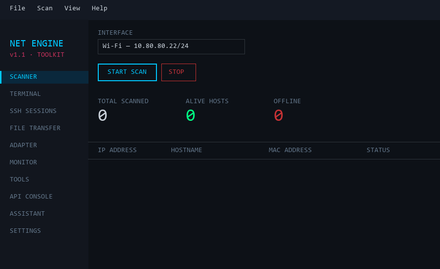
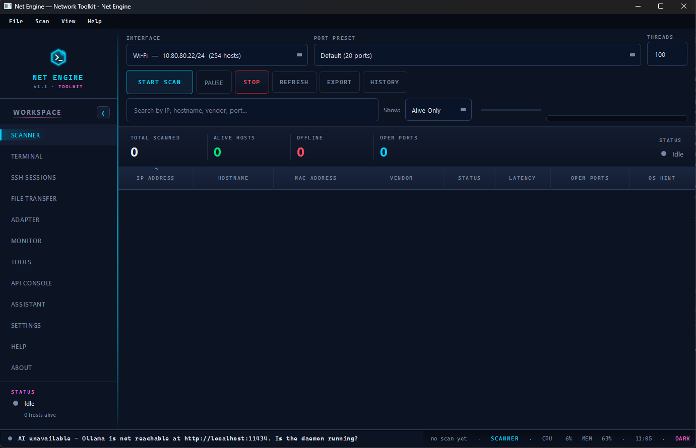
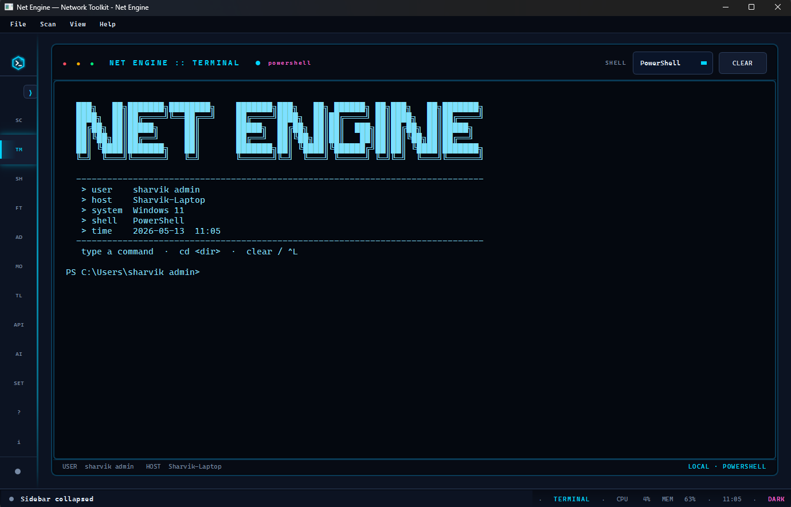
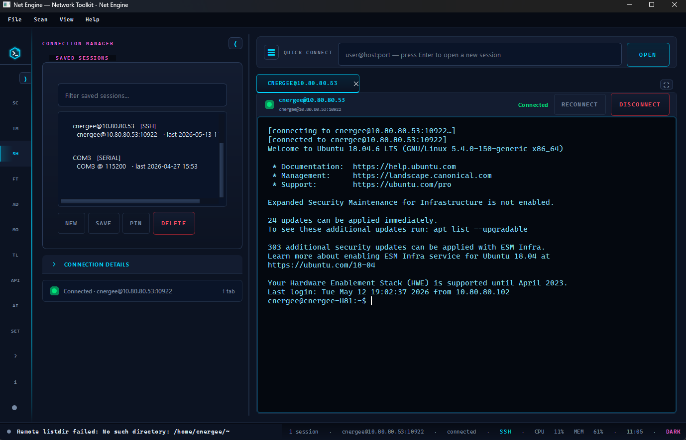
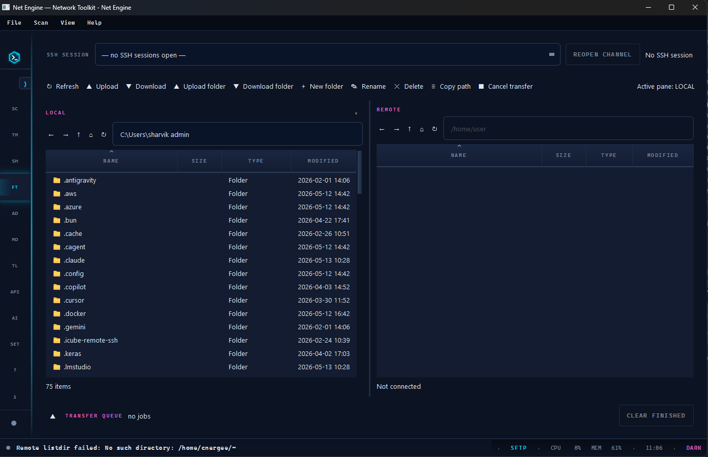
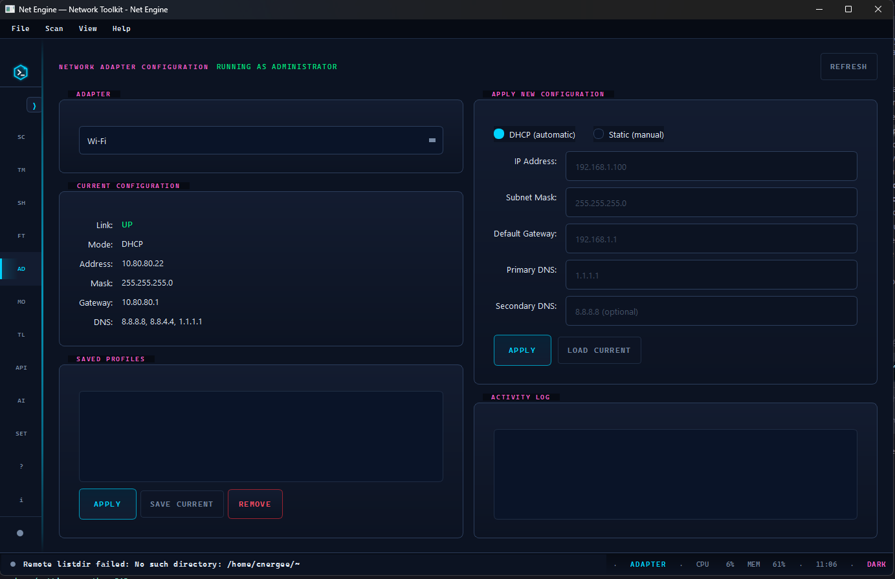
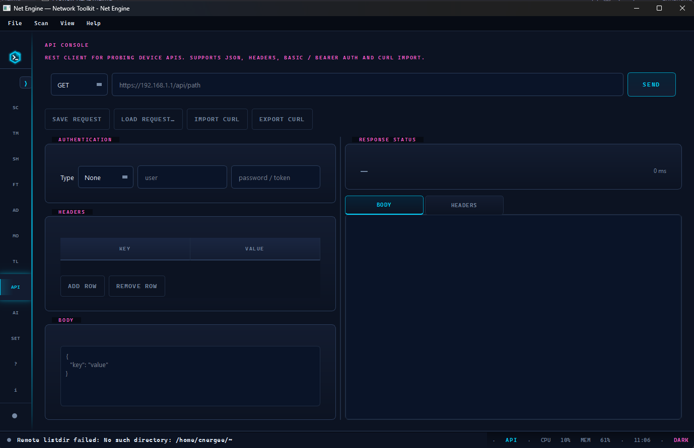
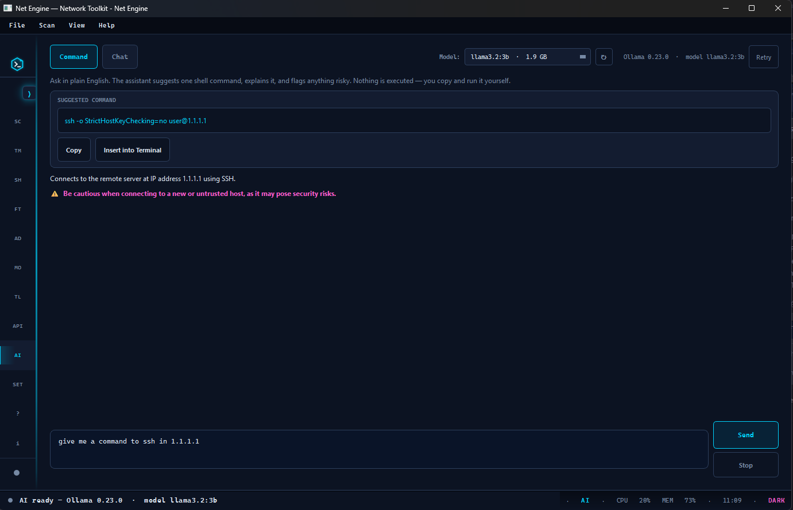
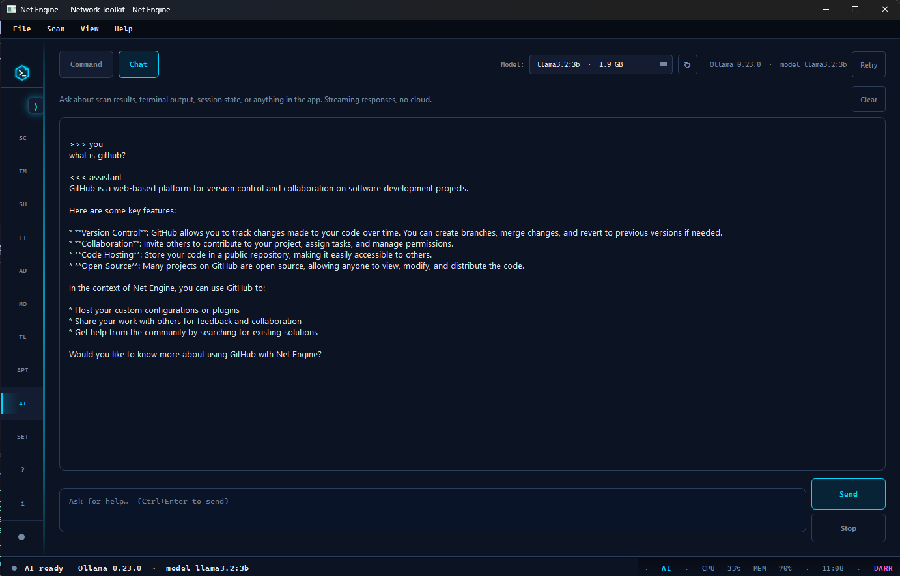
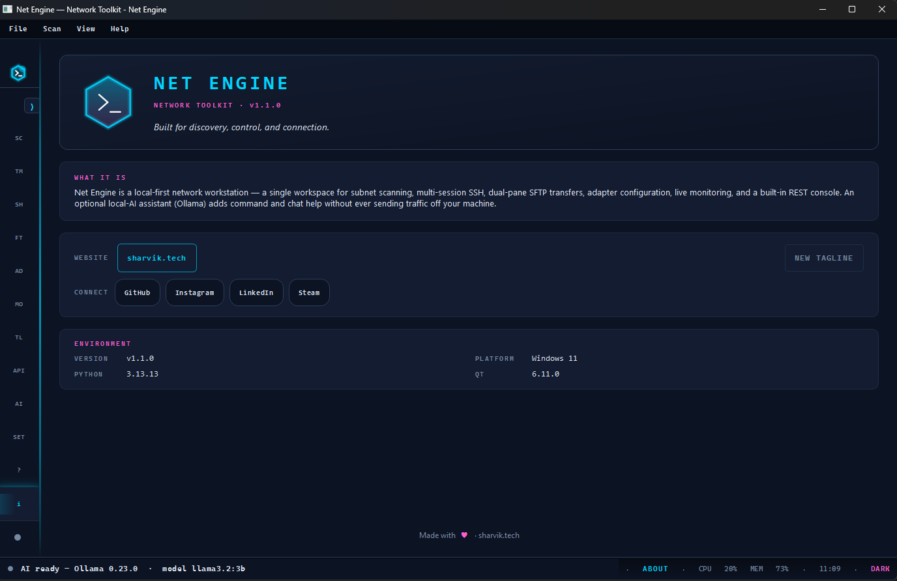

# Net Engine

A modern desktop network toolkit with an embedded terminal,
multi-session SSH client, and Windows network-adapter configurator.
Built with Python + PyQt6 — pure Python, no native extensions.




## Features

- **Subnet scanner** — concurrent ping sweep, reverse-DNS, ARP/MAC vendor
  lookup, OS hint from TTL, configurable TCP port scan, sortable + filterable
  results, CSV/JSON export, persistent scan history.



- **Host details drawer** — right-side toggleable panel that opens on row
  click and dismisses with an X button. Provides quick actions, host info,
  and an inline SSH connect form.
- **Theme system** — four built-in themes (`Dark`, `Neon`, `Space`, `Glass`)
  selectable from `View → Theme` or the Settings dialog. Themes switch
  instantly and the choice is persisted in `~/.netscope/settings.json`.
- **Embedded terminal** — full in-app terminal panel with selectable shell
  backend (`PowerShell`, `CMD`, `WSL` on Windows; `bash` on Linux). Supports
  command history, built-in `cd`/`clear`/`cls`, `Ctrl+C` / `Ctrl+L`.



- **SSH Sessions workspace** — multi-tab SSH client with collapsible
  connection form, saved-session manager (search + pin + last-connected),
  quick connect bar (`user@host:port`), per-tab status indicators, session
  duplication, and rename via double-click on the tab.




- **Network adapter configuration (Windows)** — view current IPv4 settings,
  manage saved IP profiles, and switch between DHCP and static (address /
  mask / gateway / DNS) using `netsh`. Requires Administrator to apply.


- **Monitor** — live multi-target ping monitor and one-shot port tester.
- **Tools** — quick OS diagnostics (`ipconfig`, `arp`, `route`, `netsh`)
  with custom command runner and rolling activity log.
- **API Console** — built-in REST client (Basic / Bearer auth, headers,
  body, save/load named requests, cURL import/export).


- **Local AI assistant** — optional, fully-local assistant powered by
  [Ollama](https://ollama.com). Two modes: a **Command assistant** that
  suggests one shell command per request (with explanation + caution,
  Copy / Insert-into-Terminal actions, never auto-executed), and a
  streaming **Chat assistant** for help and output interpretation.
  Ollama must be installed locally — see "Local AI (Ollama)" below.




- **Production-grade UI** — theme-driven QSS, splitter layouts, status bar
  with live CPU/MEM, keyboard shortcuts, About dialog.



## Project layout

```
NetEngine/
├── main.py                    Entry point
├── run.bat                    Launcher (Windows)
├── run-admin.bat              Launcher with elevation
├── requirements.txt
├── gui/
│   ├── themes.py              Theme palette + ThemeManager + QSS builder
│   ├── main_window.py         Sidebar + stacked pages
│   ├── dialogs.py             PortScan, Export, About dialogs
│   └── components/
│       ├── sidebar.py
│       ├── scanner_view.py
│       ├── scan_toolbar.py
│       ├── host_table.py
│       ├── detail_panel.py        Host details drawer
│       ├── terminal_view.py
│       ├── terminal_widget.py     Embedded terminal control
│       ├── collapsible.py         Collapsible section helper
│       ├── ssh_view.py            Multi-session SSH workspace
│       ├── ssh_session_tab.py     One SSH session = one tab
│       ├── monitor_view.py        Multi-ping monitor + port tester
│       ├── tools_view.py          Diagnostics + command runner
│       ├── api_console_view.py    Built-in REST client
│       └── network_config_view.py
├── ai/                            Local AI (Ollama) integration
│   ├── ollama_client.py           HTTP client, no Qt imports
│   ├── model_config.py            Local-only AIConfig (~/.netscope/settings.json)
│   ├── prompts.py                 Centralized system prompts
│   ├── command_assistant.py       One-shot command suggestion + parser
│   ├── chat_assistant.py          Bounded-history chat
│   └── ai_service.py              Façade + AIStatus + QThread workers
├── scanner/
│   ├── network.py             Interface enumeration, ARP, IP range
│   ├── host_scanner.py        Ping/DNS/MAC pipeline + ScanController QThread
│   ├── live_ping.py           Continuous ping worker for the Monitor page
│   ├── port_scanner.py        TCP connect scanner
│   ├── service_mapper.py      Port → service name + presets
│   ├── fingerprint.py         OUI vendor table + OS hint from TTL
│   ├── ssh_client.py          paramiko-based SSH session
│   └── net_config.py          Windows netsh adapter helper
└── utils/
    ├── export.py              CSV / JSON export
    ├── history.py             Scan history persistence
    └── settings.py            Theme + saved sessions + IP profiles
```

## Setup

Requires **Python 3.10+**.

```bash
python -m pip install -r requirements.txt
python main.py
```

Or on Windows just double-click `run.bat`.
For network-adapter changes, launch with `run-admin.bat` (UAC prompt).

### Dependencies

| Package   | Why                                                       |
|-----------|-----------------------------------------------------------|
| PyQt6     | Desktop UI                                                |
| psutil    | Network interface enumeration + live system metrics       |
| paramiko  | SSH transport for the multi-session client                |
| requests  | Built-in API console (optional)                           |

## Local AI (Ollama)

The Assistant page is fully optional. If Ollama is not installed or not
running the rest of the application works normally — the Assistant page
just renders a banner explaining what to fix. **Nothing in this feature
talks to the cloud.** Every inference runs on the local machine through
an Ollama daemon listening on `localhost:11434`.

### 1. Install Ollama

- **Windows / macOS** — install the Ollama Desktop app from
  <https://ollama.com>. It launches a local daemon on startup.
- **Linux** — `curl -fsSL https://ollama.com/install.sh | sh`, then
  `ollama serve` (or enable the systemd unit the installer creates).

### 2. Pull a small model

```bash
ollama pull llama3.2:3b
```

`llama3.2:3b` is the default configured in Net Engine. Any other
instruct/chat model works — change the name in the AI settings (see
below) after pulling it.

Other small options that work well for this use case:

| Model             | Size   | Notes                                       |
|-------------------|--------|---------------------------------------------|
| `llama3.2:1b`     | ~1.3GB | Fastest, lowest quality                     |
| `llama3.2:3b`     | ~2.0GB | **Default** — good balance on a laptop     |
| `qwen2.5:3b`      | ~1.9GB | Strong reasoning for the size              |
| `phi3:mini`       | ~2.3GB | Microsoft; great at short factual answers  |

### 3. Start Net Engine and open the Assistant tab

```bash
python main.py
```

Open the **Assistant** page from the sidebar (or press `Ctrl+8`). The
page has two modes:

- **Command** — type a plain-English question ("how do I check open
  ports on Windows"). The assistant responds with exactly one suggested
  command, an explanation, and an optional caution. Two actions are
  available: **Copy** (puts the command on the clipboard) and **Insert
  into Terminal** (switches to the Terminal tab and pre-fills the input
  with the command — you still have to press Enter to run it).
  Commands are **never** executed automatically.
- **Chat** — free-form streaming help chat. Use it to ask about scan
  results, interpret terminal / SSH output, or explain a feature.
  History is bounded to the last ~10 exchanges per session.

Send with **Ctrl+Enter** from the input box. **Stop** cancels an
in-flight response.

### 4. Configuration

AI settings live in `~/.netscope/settings.json` under the `ai` key:

```json
{
  "ai": {
    "enabled": true,
    "base_url": "http://localhost:11434",
    "model": "llama3.2:3b",
    "command_model": "",
    "timeout": 60,
    "temperature": 0.3,
    "max_tokens": 512,
    "system_hint": ""
  }
}
```

- `model` — main chat/instruct model. Change after pulling a new one.
- `command_model` — optional separate model for command suggestions
  (leave empty to reuse `model`).
- `timeout` — per-request timeout in seconds. Increase if your model
  is slow to load on first use.
- `system_hint` — free-form text appended to every system prompt
  (e.g. `"I use WSL Ubuntu as my default shell"`).

### 5. If Ollama is unavailable

The Assistant page shows a banner with:

- what's wrong (unreachable daemon / model not installed / etc.)
- the exact remedy (install URL, `ollama pull <model>` command, etc.)
- a **Retry** button to re-probe once you've fixed it

The rest of the app keeps working normally.

### Privacy / local-only guarantee

- The `ai/` package only talks to `localhost:11434`.
- No model training, no telemetry, no cloud API, no hosted endpoint.
- No user data leaves the machine. Prompts and responses live entirely
  in your local Ollama instance.

## OS-specific notes

- **Windows** is the primary target — pings use `ping -n 1`, ARP cache via
  `arp -a`, and adapter configuration via `netsh interface ipv4`. The
  terminal supports `PowerShell`, `CMD`, and `WSL` backends.
- **Linux/macOS** — scanner, terminal, and SSH all work. The Network
  Adapter page shows a "Windows only" notice (different OSes use different
  tools — `nmcli`, `networksetup`, etc.; not implemented in this build).
- **Admin privileges** are only required for the *Apply* action on the
  Adapter page. All other features run as a regular user.

## Keyboard shortcuts

| Shortcut   | Action                          |
|------------|---------------------------------|
| `F5`       | Start scan                      |
| `Esc`      | Stop scan                       |
| `Ctrl+E`   | Export results                  |
| `Ctrl+1…8` | Switch workspace page           |
| `Ctrl+8`   | Open AI Assistant               |
| `Ctrl+Enter` | Send AI prompt (in Assistant) |
| `Ctrl+Q`   | Quit                            |
| `Ctrl+L`   | Clear embedded terminal         |
| `Ctrl+C`   | Cancel running terminal command |

## Persistent state

Net Engine writes to `~/.netscope/`:

- `settings.json` — active theme, saved SSH sessions (passwords are not
  persisted unless the user explicitly opts in per session), saved IP
  profiles, saved API requests, terminal-shell preference
- `history/scan_*.json` — last 20 completed scans

## Limitations

- Embedded terminal is line-buffered. It is not a full PTY — programs that
  expect a TTY (e.g. `vim`, `top`) should be launched via SSH instead.
- The OUI vendor table is a hand-curated subset (~150 prefixes).
- IPv6 is not in scope; the scanner is IPv4-only.
- Network-adapter configuration is Windows only.
